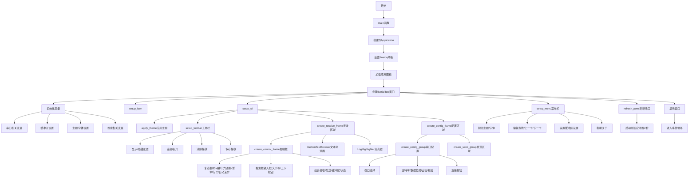
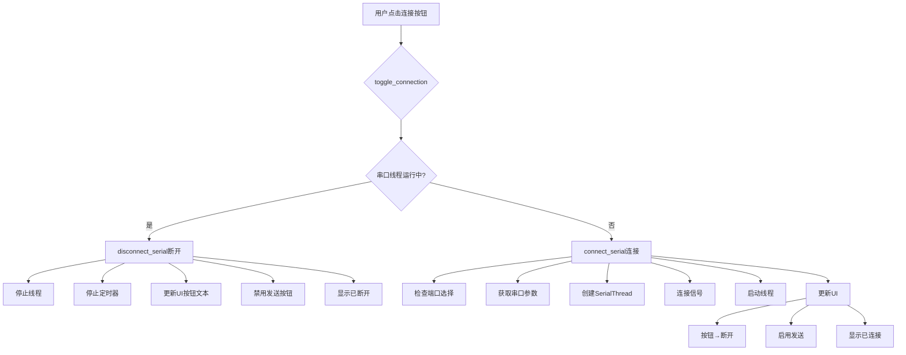
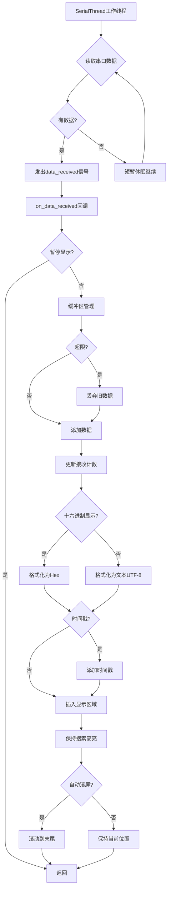
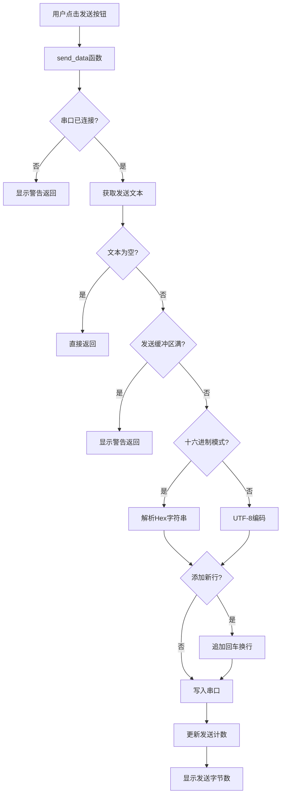
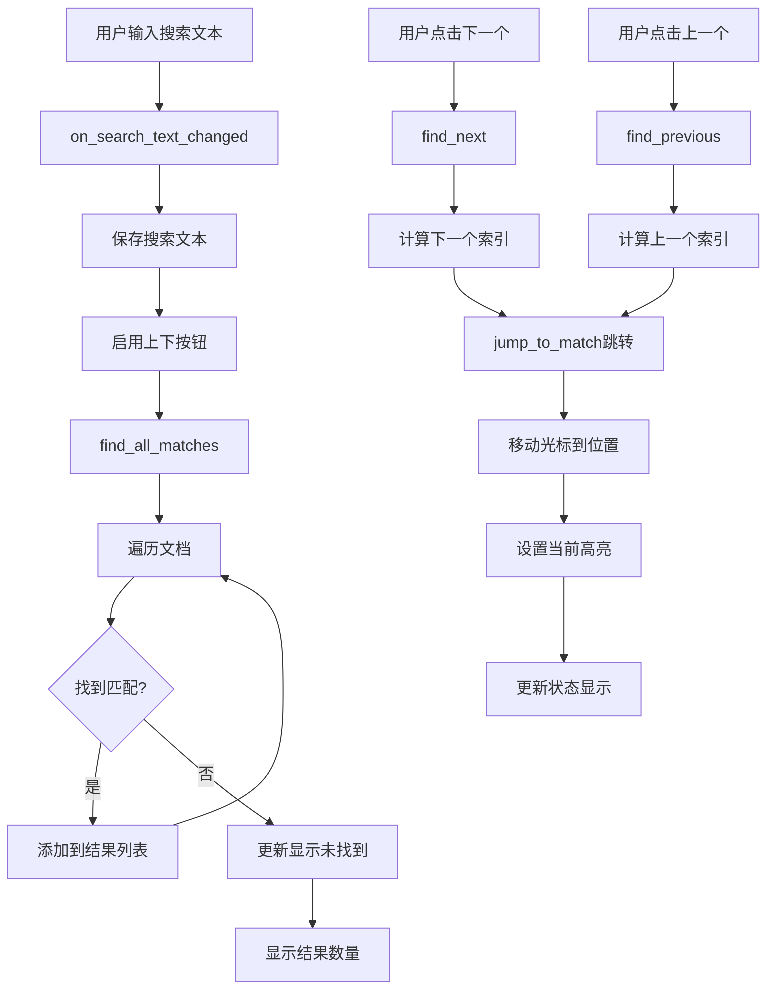
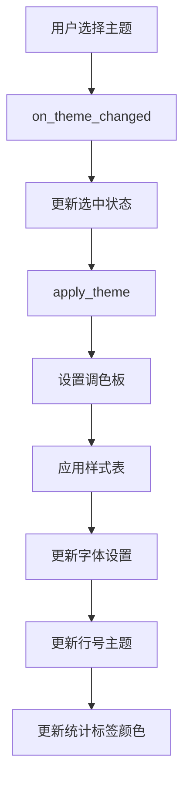
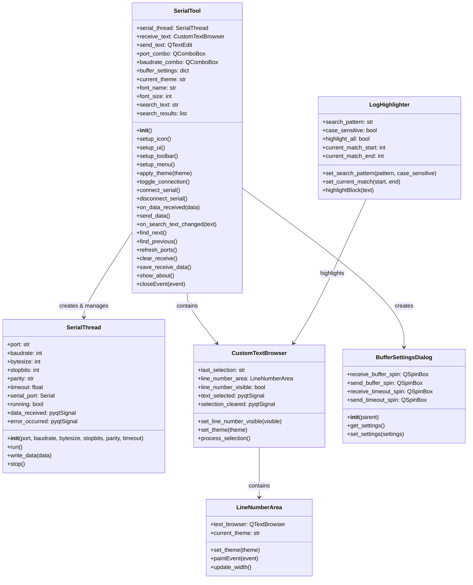
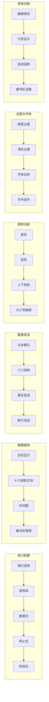
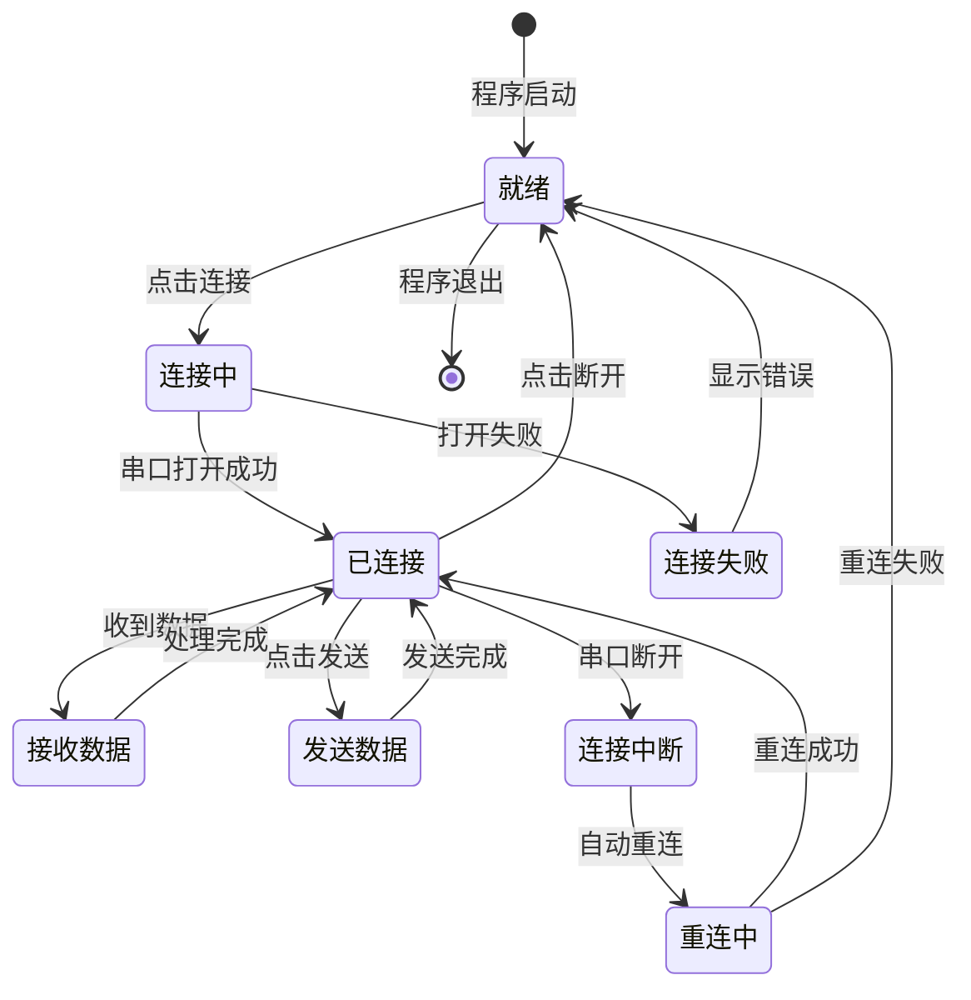

# 串口调试工具 Mermaid流程图

## 1. 程序启动流程

```mermaid
flowchart TD
    A[开始] --> B[main函数]
    B --> C[创建QApplication]
    C --> D[设置Fusion风格]
    D --> E[加载应用图标]
    E --> F[创建SerialTool窗口]
    
    F --> G[初始化变量]
    G --> G1[串口相关变量]
    G --> G2[缓冲区设置]
    G --> G3[主题/字体设置]
    G --> G4[搜索相关变量]
    
    F --> H[setup_icon]
    F --> I[setup_ui]
    
    I --> I1[apply_theme应用主题]
    I --> I2[setup_toolbar工具栏]
    I --> I3[create_receive_frame接收区域]
    I --> I4[create_config_frame配置区域]
    
    I2 --> I21[显示/隐藏配置]
    I2 --> I22[连接/断开]
    I2 --> I23[清除接收]
    I2 --> I24[保存接收]
    
    I3 --> I31[create_control_frame控制栏]
    I3 --> I32[CustomTextBrowser文本浏览器]
    I3 --> I33[LogHighlighter高亮器]
    
    I31 --> I311[复选框时间戳/十六进制/暂停/行号/自动滚屏]
    I31 --> I312[搜索栏输入框/大小写/上下按钮]
    I31 --> I313[统计接收/发送/缓冲区/状态]
    
    I4 --> I41[create_config_group串口配置]
    I4 --> I42[create_send_group发送区域]
    
    I41 --> I411[端口选择]
    I41 --> I412[波特率/数据位/停止位/校验]
    I41 --> I413[连接按钮]
    
    F --> J[setup_menu菜单栏]
    J --> J1[视图主题/字体]
    J --> J2[编辑查找/上一个/下一个]
    J --> J3[设置缓冲区设置]
    J --> J4[帮助关于]
    
    F --> K[refresh_ports刷新串口]
    K --> L[启动刷新定时器2秒]
    
    F --> M[显示窗口]
    M --> N[进入事件循环]
```

## 2. 串口连接流程

```mermaid
flowchart TD
    A[用户点击连接按钮] --> B{toggle_connection}
    
    B --> C{串口线程运行中?}
    C -->|是| D[disconnect_serial断开]
    C -->|否| E[connect_serial连接]
    
    D --> D1[停止线程]
    D --> D2[停止定时器]
    D --> D3[更新UI按钮文本]
    D --> D4[禁用发送按钮]
    D --> D5[显示已断开]
    
    E --> E1[检查端口选择]
    E --> E2[获取串口参数]
    E --> E3[创建SerialThread]
    E --> E4[连接信号]
    E --> E5[启动线程]
    E --> E6[更新UI]
    E6 --> E61[按钮→断开]
    E6 --> E62[启用发送]
    E6 --> E63[显示已连接]
```

## 3. 数据接收流程

```mermaid
flowchart TD
    A[SerialThread工作线程] --> B{读取串口数据}
    
    B --> C{有数据?}
    C -->|是| D[发出data_received信号]
    C -->|否| E[短暂休眠继续]
    
    D --> F[on_data_received回调]
    
    F --> G{暂停显示?}
    G -->|是| Z[返回]
    G -->|否| H[缓冲区管理]
    
    H --> H1{超限?}
    H1 -->|是| H2[丢弃旧数据]
    H1 -->|否| H3[添加数据]
    H2 --> H3
    
    H3 --> I[更新接收计数]
    I --> J{十六进制显示?}
    J -->|是| K[格式化为Hex]
    J -->|否| L[格式化为文本UTF-8]
    
    K --> M{时间戳?}
    L --> M
    
    M -->|是| N[添加时间戳]
    M -->|否| O[插入显示区域]
    N --> O
    
    O --> P[保持搜索高亮]
    P --> Q{自动滚屏?}
    Q -->|是| R[滚动到末尾]
    Q -->|否| S[保持当前位置]
    R --> Z
    S --> Z
    
    E --> B
```

## 4. 数据发送流程

```mermaid
flowchart TD
    A[用户点击发送按钮] --> B[send_data函数]
    
    B --> C{串口已连接?}
    C -->|否| D[显示警告返回]
    C -->|是| E[获取发送文本]
    
    E --> F{文本为空?}
    F -->|是| G[直接返回]
    F -->|否| H{发送缓冲区满?}
    
    H -->|是| I[显示警告返回]
    H -->|否| J{十六进制模式?}
    
    J -->|是| K[解析Hex字符串]
    J -->|否| L[UTF-8编码]
    
    K --> M{添加新行?}
    L --> M
    
    M -->|是| N[追加回车换行]
    M -->|否| O[写入串口]
    N --> O
    
    O --> P[更新发送计数]
    P --> Q[显示发送字节数]
```

## 5. 搜索功能流程

```mermaid
flowchart TD
    A[用户输入搜索文本] --> B[on_search_text_changed]
    
    B --> C[保存搜索文本]
    C --> D[启用上下按钮]
    D --> E[find_all_matches]
    
    E --> F[遍历文档]
    F --> G{找到匹配?}
    G -->|是| H[添加到结果列表]
    G -->|否| I[更新显示未找到]
    H --> F
    
    I --> J[显示结果数量]
    
    K[用户点击下一个] --> L[find_next]
    M[用户点击上一个] --> N[find_previous]
    
    L --> O[计算下一个索引]
    N --> P[计算上一个索引]
    
    O --> Q[jump_to_match跳转]
    P --> Q
    
    Q --> R[移动光标到位置]
    R --> S[设置当前高亮]
    S --> T[更新状态显示]
```

## 6. 主题切换流程

```mermaid
flowchart TD
    A[用户选择主题] --> B[on_theme_changed]
    
    B --> C[更新选中状态]
    C --> D[apply_theme]
    
    D --> E[设置调色板]
    E --> F[应用样式表]
    F --> G[更新字体设置]
    G --> H[更新行号主题]
    H --> I[更新统计标签颜色]
```

## 7. 类关系图

```mermaid
classDiagram
    class SerialTool {
        +serial_thread: SerialThread
        +receive_text: CustomTextBrowser
        +send_text: QTextEdit
        +port_combo: QComboBox
        +baudrate_combo: QComboBox
        +buffer_settings: dict
        +current_theme: str
        +font_name: str
        +font_size: int
        +search_text: str
        +search_results: list
        +__init__()
        +setup_icon()
        +setup_ui()
        +setup_toolbar()
        +setup_menu()
        +apply_theme(theme)
        +toggle_connection()
        +connect_serial()
        +disconnect_serial()
        +on_data_received(data)
        +send_data()
        +on_search_text_changed(text)
        +find_next()
        +find_previous()
        +refresh_ports()
        +clear_receive()
        +save_receive_data()
        +show_about()
        +closeEvent(event)
    }
    
    class SerialThread {
        +port: str
        +baudrate: int
        +bytesize: int
        +stopbits: int
        +parity: str
        +timeout: float
        +serial_port: Serial
        +running: bool
        +data_received: pyqtSignal
        +error_occurred: pyqtSignal
        +__init__(port, baudrate, bytesize, stopbits, parity, timeout)
        +run()
        +write_data(data)
        +stop()
    }
    
    class CustomTextBrowser {
        +last_selection: str
        +line_number_area: LineNumberArea
        +line_number_visible: bool
        +text_selected: pyqtSignal
        +selection_cleared: pyqtSignal
        +set_line_number_visible(visible)
        +set_theme(theme)
        +process_selection()
    }
    
    class LineNumberArea {
        +text_browser: QTextBrowser
        +current_theme: str
        +set_theme(theme)
        +paintEvent(event)
        +update_width()
    }
    
    class LogHighlighter {
        +search_pattern: str
        +case_sensitive: bool
        +highlight_all: bool
        +current_match_start: int
        +current_match_end: int
        +set_search_pattern(pattern, case_sensitive)
        +set_current_match(start, end)
        +highlightBlock(text)
    }
    
    class BufferSettingsDialog {
        +receive_buffer_spin: QSpinBox
        +send_buffer_spin: QSpinBox
        +receive_timeout_spin: QSpinBox
        +send_timeout_spin: QSpinBox
        +__init__(parent)
        +get_settings()
        +set_settings(settings)
    }
    
    SerialTool --> SerialThread : creates & manages
    SerialTool --> CustomTextBrowser : contains
    SerialTool --> BufferSettingsDialog : creates
    CustomTextBrowser --> LineNumberArea : contains
    LogHighlighter --> CustomTextBrowser : highlights
```

## 8. 功能模块一览

```mermaid
flowchart LR
    subgraph 串口配置
        A1[端口选择] --> A2[波特率]
        A2 --> A3[数据位]
        A3 --> A4[停止位]
        A4 --> A5[校验位]
    end
    
    subgraph 数据接收
        B1[实时显示] --> B2[十六进制/文本]
        B2 --> B3[时间戳]
        B3 --> B4[缓冲区管理]
    end
    
    subgraph 数据发送
        C1[文本模式] --> C2[十六进制]
        C2 --> C3[重复发送]
        C3 --> C4[新行添加]
    end
    
    subgraph 搜索功能
        D1[查找] --> D2[高亮]
        D2 --> D3[上下导航]
        D3 --> D4[大小写敏感]
    end
    
    subgraph 主题与字体
        E1[暗黑主题] --> E2[浅色主题]
        E2 --> E3[字体名称]
        E3 --> E4[字号调节]
    end
    
    subgraph 其他功能
        F1[数据保存] --> F2[行号显示]
        F2 --> F3[自动滚屏]
        F3 --> F4[缓冲区设置]
    end
```

## 9. 状态流程图

```mermaid
stateDiagram-v2
    [*] --> 就绪: 程序启动
    
    就绪 --> 连接中: 点击连接
    连接中 --> 已连接: 串口打开成功
    连接中 --> 连接失败: 打开失败
    连接失败 --> 就绪: 显示错误
    
    已连接 --> 接收数据: 收到数据
    已连接 --> 发送数据: 点击发送
    已连接 --> 连接中断: 串口断开
    连接中断 --> 重连中: 自动重连
    重连中 --> 已连接: 重连成功
    重连中 --> 就绪: 重连失败
    
    接收数据 --> 已连接: 处理完成
    发送数据 --> 已连接: 发送完成
    
    已连接 --> 就绪: 点击断开
    就绪 --> [*]: 程序退出
```
